# G-Space: An Information-Theoretic Model of Quantum Gravitational Correlations

**Keyvan M. Sadeghi**
*August 2025*

---

## Abstract

We propose a coordinate system for gravitational systems defined not by spacetime positions but by information-theoretic parameters: gravitational entropy $(S_g)$ from Bekenstein-Hawking and generalized entropy, propagation kernel $(\mathcal{P}_g)$ defined via influence functionals, and entanglement spectrum $(\Phi_E)$ based on modular Hamiltonian eigenspectra. Under the simplifying assumption that systems sharing identical coordinates may exhibit nonlocal quantum correlations beyond standard QFT, we derive specific predictions for phase coherence in Hawking radiation. While astrophysical tests require sensitivity improvements of $\sim 10^{60}$, we propose laboratory analogs, particularly in Bose-Einstein condensate analogs of black holes, that may empirically test the model's central postulate. We emphasize this is an exploratory model—not a new theory of quantum gravity, but a tool for uncovering potential correlations embedded in its informational substrate.

---

## 1. Introduction

Recent developments in quantum gravity suggest spacetime may be emergent rather than fundamental [1-3]. The AdS/CFT correspondence [4] demonstrates that aspects of bulk geometry can be encoded in boundary entanglement [5], while the ER=EPR conjecture links geometric and quantum connectivity [6]. These established results motivate exploring models where information and entanglement play primary roles. Recent work by Neukart has proposed that quantum information directly shapes spacetime curvature through an informational stress-energy tensor [12], providing additional support for information-theoretic approaches to gravity.

This paper develops a parameterization tool—not a theory of everything—that treats gravitational systems as if they were characterized by three information-theoretic coordinates rather than spacetime position. We examine the consequences of assuming that systems with matching information-theoretic parameters—regardless of spacetime location—may exhibit measurable correlations. While this assumption may ultimately be false, pursuing it yields concrete predictions that can guide both theoretical development and experimental design.

Specifically, we model systems using:
- Gravitational entropy (building on holographic principles)
- Propagation kernel (extending influence functional methods)
- Entanglement spectrum (via modular Hamiltonian spectra)

Our goals are:
1. Develop precise mathematical definitions for these coordinates
2. Derive observable consequences under our working assumptions
3. Design falsifiable tests in both astrophysical and analog settings
4. Establish sensitivity benchmarks for future experiments

This exploratory model aims to test whether information-theoretic coordinates reveal hidden structure in gravitational phenomena.

---

## 2. The G-Space Model

### 2.1 Coordinate Definitions

We model gravitational systems using three coordinates grounded in established physics. Note that G-space is not a spacetime manifold, but a coordinate space indexing gravitational systems by informational parameters. Unlike a conventional manifold with local neighborhoods and metric structure derived from proximity, G-space groups systems by their information-theoretic properties regardless of spacetime separation.

**Gravitational Entropy** $S_g$: Following the holographic principle, for a codimension-2 surface $\Sigma$:
$$S_g[\Sigma] = \frac{A[\Sigma]}{4G\hbar} + S_{\text{matter}}[\mathcal{R}] + \mathcal{O}(\hbar)$$

This is the generalized entropy of Bekenstein and Hawking, extended to include matter contributions as in the generalized second law. The $\mathcal{O}(\hbar)$ term captures quantum gravity corrections that, while negligible for macroscopic black holes, become significant for Planck-scale systems or near-extremal configurations where quantum effects dominate. In AdS/CFT contexts, this equals boundary entanglement entropy via Ryu-Takayanagi.

**Propagation Kernel** $\mathcal{P}_g^{\mu\nu}$: Defined through the influence functional formalism:
$$\mathcal{P}_g^{\mu\nu}(x) = \int_{\mathcal{D}} T^{\mu\nu}(x') K[x,x'] \sqrt{-g} \, d^4x'$$

where $\mathcal{D}$ is the causal diamond (or more generally, the domain of dependence) containing the system of interest—typically the region bounded by the intersection of past and future light cones from the system's worldline. The self-consistency requirement that the metric determining $K$ derives from $\mathcal{P}_g$ itself follows standard Dyson-Schwinger iteration schemes (see Appendix A for explicit construction). Here, $K[x,x'] = \text{Tr}[\rho W(x,x')]$ is the quantum-averaged Wightman kernel encoding causal influence. Other choices of $K[x,x']$, such as Feynman or Hadamard kernels, may yield variant formulations of $\mathcal{P}_g$, potentially encoding different aspects of quantum influence. This approach shares conceptual similarities with Neukart's informational stress-energy tensor [12], though our propagation kernel focuses on causal structure rather than direct curvature modification. Recent results suggest that spacetime curvature modulates gravity-mediated entanglement [15], supporting the idea that $\mathcal{P}_g$ encodes both geometric and causal influence.

**Entanglement Spectrum** $\Phi_E$: The minimal sufficient statistics of the modular Hamiltonian spectrum:
$$\Phi_E = \{\mu_n(\Lambda)\}_{n=1}^{N(\Lambda)}$$

where $\mu_n$ are eigenvalues of the modular Hamiltonian $H_{\text{mod}} = -\log \rho_A$ coarse-grained at scale $\Lambda$, and $N(\Lambda) \sim A/\Lambda^2$ bounds the number of relevant modes. Unlike the entanglement spectrum in condensed matter physics (which typically refers to Schmidt values [11]), we use the modular Hamiltonian eigenspectrum to capture gravitational entanglement structure. This choice is motivated by the modular Hamiltonian's direct connection to local physics in QFT: it generates boost transformations in Rindler space and encodes the local temperature felt by accelerated observers. For gravitational systems, where local observables and horizons play crucial roles, the modular spectrum provides a more physically relevant characterization than abstract Schmidt coefficients. This provides a finite parameterization connected to observable quantities like modular flow and relative entropy.

### 2.2 Working Assumption: Coordinate Matching Implies Correlation

**Model Assumption**: We explore consequences under the assumption that systems sharing identical $(S_g, \mathcal{P}_g, \Phi_E)$ coordinates exhibit quantum correlations beyond those predicted by local quantum field theory. This extends the EPR concept of entanglement to an information-theoretic coordinate space where "sameness" is defined not by shared quantum state but by identical gravitational-informational properties.

Under this assumption:

**Case 1**: All Schwarzschild black holes of mass $M$ share coordinates:
$$(S_g, \mathcal{P}_g, \Phi_E) = \left(\frac{4\pi GM^2}{\hbar c}, \mathcal{P}_{\text{Sch}}(M), \{\mu_n^{\text{thermal}}(T_H)\}\right)$$

where $T_H = \hbar c^3/(8\pi GMk_B)$ is the Hawking temperature, with $k_B$ being Boltzmann's constant.

**Case 2**: All Minkowski vacuum regions share:
$$(S_g, \mathcal{P}_g, \Phi_E) = (0, \eta^{\mu\nu}, \{\mu_n^{\text{vac}}\})$$

Even the Minkowski vacuum exhibits a non-trivial entanglement spectrum $\{\mu_n^{\text{vac}}\}$, arising from quantum fluctuations across causal horizons (e.g., Rindler wedges). This reflects the deep connection between vacuum entanglement and emergent geometry.

This assumption—that coordinate matching implies correlation—is the core hypothesis we seek to test. It may be false, but exploring its consequences yields specific predictions.

---

## 3. Emergence of Spacetime

### 3.1 The Projection Map

In our model, spacetime emerges via projection maps $\Pi_x: \mathcal{G} \rightarrow \mathcal{M}^4$ that map G-space coordinates to spacetime events. Multiple projections of the same G-space coordinates yield apparently distinct objects:

$$|\text{BH at } x_1\rangle = \Pi_{x_1}|S_g(M), \mathcal{P}_g(M), \Phi_E(M)\rangle$$

$$|\text{BH at } x_2\rangle = \Pi_{x_2}|S_g(M), \mathcal{P}_g(M), \Phi_E(M)\rangle$$

```mermaid
graph TD
    subgraph "Spacetime Manifold"
        BH1["Black Hole<br/>Milky Way<br/>(x₁, t₁)<br/><i>Same G-coordinates</i>"]
        BH2["Black Hole<br/>Andromeda<br/>(x₂, t₂)<br/><i>Same G-coordinates</i>"]
        BH3["Black Hole<br/>Virgo Cluster<br/>(x₃, t₃)<br/><i>Same G-coordinates</i>"]
    end
    
    subgraph "G-Space"
        G["Single G-Space Point<br/>S_g = 4πGM²/ℏc<br/>𝒫_g = 𝒫_Sch(M)<br/>Φ_E = Φ_thermal(T_H)"]
    end
    
    BH1 -.->|"Π_x₁"| G
    BH2 -.->|"Π_x₂"| G
    BH3 -.->|"Π_x₃"| G
    
    style G fill:#f9f,stroke:#333,stroke-width:4px,color:#000
    style BH1 fill:#bbf,stroke:#333,stroke-width:2px,color:#000
    style BH2 fill:#bbf,stroke:#333,stroke-width:2px,color:#000
    style BH3 fill:#bbf,stroke:#333,stroke-width:2px,color:#000
```

**Figure:** Multiple spacetime realizations of a single G-space point. Each projection $\Pi_{x_i}$ maps the same gravitational-information coordinate to a different spacetime location.

The construction of explicit $\Pi_x$ maps remains an open problem. They must satisfy:
- **Causality**: Spacelike-separated projections preserve local physics
- **Consistency**: Overlapping projections agree on shared regions
- **Decoherence**: Environmental coupling selects stable projection bases

These maps might relate to tensor network encodings (MERA, HaPPY codes) or holographic dictionaries in AdS/CFT. Specifically, they may connect to holographic tensor networks as explored in [8] and the entanglement-geometry correspondence developed by Swingle [3]. Our projection maps generalize these ideas by allowing multiple spacetime "outlets" for a single G-space point, whereas traditional tensor networks map entanglement patterns to unique geometric regions. This multiplicity is what enables the non-local correlations central to our model. The recent work by Brahma and Seenivasan [15] showing that spacetime curvature affects gravity-mediated entanglement provides additional evidence that geometric properties are encoded in quantum correlations, supporting our framework where $\mathcal{P}_g$ encodes both causal and geometric information. We return to experimental implications of these coordinate-defined projections in Section 4.

### 3.2 Dynamics

Evolution in the model follows:
$$i\hbar \frac{\partial}{\partial \tau}|\Psi\rangle = \hat{H}_{\mathcal{G}}|\Psi\rangle$$

where $\tau$ is a global evolution parameter in G-space—not coordinate time but analogous to an affine parameter that different observers relate to their local time differently. We assume $\tau$ is not directly observable, but relates to local proper time via projection maps $\Pi_x$. Classical general relativity emerges when $S_g \gg 1$ and quantum corrections become negligible.

---

## 4. Observable Predictions

*Note: This section derives theoretical consequences of our model. Direct astrophysical tests are beyond current technology; we focus on establishing benchmarks and designing analog experiments.*

### 4.1 Theoretical Signatures

If coordinate matching implies correlation, we predict phase coherence in Hawking radiation:

$$C_{12}(\omega) = \langle \hat{a}^\dagger_\omega(x_1) \hat{a}_\omega(x_2) \rangle = \frac{\hbar \omega}{e^{\beta\hbar\omega} - 1} \times F(|x_1 - x_2|, L_{\text{coh}})$$

where the decay function takes the form:
$$F(d, L_{\text{coh}}) = \exp\left(-\frac{d^2}{2L_{\text{coh}}^2}\right)$$

This Gaussian decay reflects decoherence from environmental interactions, with coherence length:
$$L_{\text{coh}} \sim \frac{c}{\omega} \sqrt{\frac{M}{M_P}}$$

**Sensitivity benchmark**: For stellar-mass black holes, detecting such correlations would require:
- Temperature sensitivity: $\Delta T < 10^{-7}$ K (Hawking temperature)
- Phase resolution: $\Delta \phi < 10^{-60}$ rad (accounting for signal strength)
- Integration time: $t > 10^{100}$ s (for single-photon statistics)

These estimates highlight the challenge, not imply immediate feasibility. They serve as theoretical benchmarks analogous to how early atomic theory required seemingly impossible precision later achieved through technological advance.

### 4.2 Toward Falsifiability: A Roadmap

The model makes falsifiable predictions at multiple scales:

| Test Type | Difficulty | Signal Strength | Falsification Criterion |
|-----------|------------|-----------------|------------------------|
| **Analog Black Holes** (BEC) | Near-term | $\text{SNR} \sim 10$ | No phase correlation above thermal noise |
| **Quantum Information** | Medium-term | Direct measurement | No enhanced correlations for matched $\{\mu_n\}$ |
| **Cosmological** | Long-term | $10^{-15}$ relative | No CMB anomalies at large angular scales |
| **Astrophysical** | Far future | $10^{-60}$ relative | No BH radiation correlations |

Our approach builds on recent proposals for detecting gravity-mediated entanglement. Krisnanda et al. [13] have shown that gravitational coupling between masses can generate observable entanglement, though they focus on optomechanical setups rather than our coordinate-matching principle. More recently, Anastopoulos et al. [14] demonstrated that even classical Newtonian evolution can generate similar entanglement, highlighting the need for careful interpretation of such experiments. Brahma and Seenivasan [15] extended these ideas to cosmological settings, showing that spacetime curvature affects gravity-induced entanglement—a result that supports our prediction that G-space coordinates encode geometric information. The recent surge of interest in gravity-mediated entanglement experiments [13] further motivates the use of analog systems to test these correlations.

**A. Analog Black Hole Systems**

In Bose-Einstein condensates or optical analogs where sonic/optical horizons can be created:

1. Create multiple horizons with identical parameters (mass analog $M_{\text{eff}}$)
2. Measure phonon/photon emission from each horizon
3. **Falsification criterion**: If measured phase correlations across analog horizons do not exceed thermal noise—after removing classical correlations—the model is falsified

Expected signal in BEC systems:
$$\text{SNR}_{\text{analog}} \sim \sqrt{N_{\text{horizons}}} \times \frac{T_{\text{lab}}}{T_{\text{Hawking,analog}}} \times Q$$

where $Q$ is the cavity quality factor (ratio of stored energy to energy loss per cycle). With $T_{\text{Hawking,analog}} \sim \mu$K achievable in current setups, this brings tests within reach.

**B. Quantum Information Tests**

The entanglement spectrum $\Phi_E$ can be tested in controllable quantum systems:

1. Prepare multiple copies of identical entangled states in separated locations
2. Measure modular flow correlations between copies
3. **Falsification criterion**: If systems with identical $\{\mu_n\}$ spectra show no enhanced correlations beyond quantum mechanics predictions, the model's core assumption fails

Recent work has successfully reconstructed modular Hamiltonians in spin chains [9] and trapped ion systems [10], making such tests experimentally feasible.

**C. Cosmological Constraints**

If vacuum regions share correlations, this affects:
- CMB fluctuation statistics at large angular separations
- Vacuum birefringence measurements
- Casimir force modifications

Any of these not matching predictions would falsify the model.

---

## 5. Consistency Checks

### 5.1 Causality Preservation

The model must not enable superluminal signaling. We argue correlations preserve causality through:
- **No-signaling theorem**: Like EPR pairs, correlations cannot transmit information
- **Projection constraints**: Local operations at $x_1$ cannot affect measurements at spacelike-separated $x_2$
- **Holographic bound**: Information flow limited by area/entropy constraints

Crucially, non-signaling is preserved even under G-space correlations because projection maps $\Pi_x$ are constructed to prevent causal paradoxes—they allow correlations but not communication between spacelike-separated regions.

However, proving this rigorously requires developing the full projection map formalism—a key open problem. Recent work by Anastopoulos et al. [14] showing that classical Newtonian dynamics can generate entanglement without violating causality provides a useful consistency check, though our framework predicts stronger correlations due to the coordinate-matching principle.

### 5.2 Decoherence Analysis

Standard quantum decoherence would destroy correlations on timescale:
$$\tau_{\text{dec}} \sim \frac{\hbar}{k_B T_{\text{env}}} \times \frac{M}{M_P}$$

For astrophysical black holes in CMB background ($T_{\text{env}} \sim 3$ K):
$$\tau_{\text{dec}} \sim 10^{40} \text{ s} \times \left(\frac{M}{M_\odot}\right)$$

This exceeds the age of the universe, suggesting correlations could survive. However, this assumes:
- Standard decoherence models apply unchanged
- No additional G-space-specific decoherence mechanisms
- Environmental coupling strength remains perturbative

These assumptions, while plausible, highlight the need for a detailed decoherence analysis within the full G-space formalism.

### 5.3 Classical and Quantum Limits

The model must reproduce known physics in appropriate limits:

**Classical limit** ($S_g \gg k$):
- Holographic entropy → Bekenstein-Hawking area law ✓
- $\mathcal{P}_g$ → Classical stress-energy via Einstein equations ✓
- $\Phi_E$ → Uncorrelated product states (needs verification)

**Flat space limit** ($\mathcal{P}_g \to \eta^{\mu\nu}$):
- Minkowski vacuum recovered by construction ✓
- Propagation kernel → Standard QFT propagators ✓
- Modular Hamiltonian → Rindler boost generator ✓

**Unentangled limit** ($\Phi_E \to \Phi_{\text{product}}$):
- Systems decouple as expected (follows from modular Hamiltonian properties)
- Correlations vanish, recovering local physics

Detailed verification awaits full development of projection maps.

---

## 6. Discussion

### 6.1 Relation to Established Physics

Our model builds on solid foundations while adding speculative elements:

**Established foundations**:
- Holographic entropy (Bekenstein-Hawking, Ryu-Takayanagi) provides $S_g$
- Influence functionals (Feynman-Vernon) motivate propagation kernel $\mathcal{P}_g$ 
- Modular Hamiltonians in algebraic QFT ground $\Phi_E$

**Speculative additions**:
- Assumption that coordinate matching implies correlation
- Non-local phase coherence between separated systems
- Projection operators creating spacetime multiplicity

The model shares motivations with entropic gravity [7] and tensor network approaches [8] but differs fundamentally: we treat entropy as a coordinate rather than a force-generating principle, and propose testable correlations rather than geometric emergence alone. Unlike causal sets or quantum causal structures which discretize spacetime itself, G-space maintains a smooth coordinate structure while allowing discrete projection points.

### 6.2 Theoretical Value of Extreme Predictions

Though the $10^{60}$ sensitivity gap seems insurmountable, such extreme predictions serve important purposes:

1. **Clarity**: Unambiguous targets prevent vague claims
2. **Guidance**: Helps design analog experiments at accessible scales
3. **Benchmarking**: Quantifies the challenge for future technology
4. **Consistency**: Forces careful analysis of decoherence and noise

Historical precedent: Democritus envisioned atoms millennia before direct detection was possible. The value was in the precise conceptual framework, not immediate verification.

### 6.3 Open Questions

Critical issues for development:

1. **Mathematical**: Does the $\mathcal{P}_g$ iteration converge for generic spacetimes?
2. **Physical**: Can projection maps be constructed preserving unitarity?
3. **Computational**: Do G-space coordinates simplify any calculations?
4. **Experimental**: What analog system best captures the essential physics of entanglement spectrum matching?

### 6.4 Limitations and Scope

**What this model provides**:
- Precise mathematical definitions of information-theoretic coordinates
- Concrete predictions distinguishing it from standard physics
- Falsifiable tests in analog systems
- Theoretical benchmarks for future experiments

**What this model does not claim**:
- That nature necessarily works this way
- That current technology can test astrophysical predictions
- That it solves quantum gravity
- That all consistency issues are resolved

**Key assumptions** (unproven but falsifiable):
1. Coordinate matching implies correlation (core hypothesis)
2. Projection maps exist preserving causality
3. Environmental decoherence allows some correlation survival
4. The iterative construction mathematically converges

The model's purpose is to explore whether information-theoretic parameterization reveals hidden structure. Its assumptions may be wrong, but they are wrong in a precise, testable way.

## 7. Conclusion

We have developed a model that parameterizes gravitational systems using information-theoretic coordinates $(S_g, \mathcal{P}_g, \Phi_E)$ and explored consequences of the assumption that coordinate matching implies quantum correlations. This assumption yields concrete predictions: phase coherence in Hawking radiation with sensitivity requirements quantified at $\sim 10^{60}$ improvement over current technology, and specific falsifiable tests in analog systems.

The model's value lies in:
- Providing a systematic framework for searching for information-theoretic structure in gravity
- Generating precise, falsifiable predictions distinguishing it from standard physics  
- Suggesting experimental pathways through analog systems, particularly BECs
- Offering a background-independent formulation where spacetime emerges from G-space

Future work should focus on developing analog experiments, refining the mathematical formalism (especially projection maps), and exploring connections to established quantum gravity approaches. The recent surge of interest in gravity-mediated entanglement [13-15] and information-theoretic approaches to gravity [12] suggests the field is ripe for frameworks like G-space that make precise, testable predictions about quantum gravitational phenomena. Whether nature realizes anything resembling this model remains open, but its precision enables meaningful empirical investigation.

Recent proposals [12-15] have increasingly treated quantum correlations as carriers of geometric or gravitational information, lending support to the kind of coordinate-based framework we explore here. While G-space may or may not describe nature, it offers a precise, falsifiable lens through which we may uncover the hidden symmetries of gravity and information.

## Acknowledgments

We thank [colleagues] for discussions.

## References

[1] Van Raamsdonk, M. (2010). "Building up spacetime with quantum entanglement." Gen. Rel. Grav. 42, 2323.

[2] Jacobson, T. (1995). "Thermodynamics of spacetime: The Einstein equation of state." Phys. Rev. Lett. 75, 1260.

[3] Swingle, B. (2012). "Entanglement renormalization and holography." Phys. Rev. D 86, 065007.

[4] Maldacena, J. (1998). "The Large N Limit of Superconformal Field Theories and Supergravity." Adv. Theor. Math. Phys. 2, 231–252. [arXiv:hep-th/9711200](https://arxiv.org/abs/hep-th/9711200).

[5] Ryu, S. & Takayanagi, T. (2006). "Holographic derivation of entanglement entropy from AdS/CFT." Phys. Rev. Lett. 96, 181602.

[6] Maldacena, J. & Susskind, L. (2013). "Cool horizons for entangled black holes." Fortsch. Phys. 61, 781.

[7] Verlinde, E. (2011). "On the origin of gravity and the laws of Newton." JHEP 04, 029.

[8] Pastawski, F., Yoshida, B., Harlow, D. & Preskill, J. (2015). "Holographic quantum error-correcting codes." JHEP 06, 149.

[9] Dymarsky, A. & Liu, H. (2018). "Canonical approach to holographic Renyi entropy." Phys. Rev. D 97, 126014.

[10] Cian, Z.-P., et al. (2022). "Many-body Chern number from statistical correlations of randomized measurements." Phys. Rev. Lett. 128, 010501.

[11] Li, H. & Haldane, F.D.M. (2008). "Entanglement spectrum as a generalization of entanglement entropy: Identification of topological order in non-abelian fractional quantum Hall effect states." Phys. Rev. Lett. 101, 010504.

[12] Neukart, F. (2025). "Quantum information dynamics and emergent gravity: A unified framework." Annals of Physics 474, 169811.

[13] Krisnanda, T., Tham, G.Y., Paternostro, M. & Paterek, T. (2020). "Observable quantum entanglement due to gravity." npj Quantum Information 6, 12.

[14] Anastopoulos, C., Lagouvardos, M. & Savvidou, K.N. (2025). "Newton's laws of motion generating gravity-mediated entanglement." Phys. Rev. A 111, 042202.

[15] Brahma, S. & Seenivasan, A.N. (2023). "Probing the curvature of the cosmos from quantum entanglement due to gravity." Int. J. Mod. Phys. D 32, 2342010.

## Appendix A: Technical Derivations

### A.1 Schwarzschild Black Hole: $\mathcal{P}_g$ Computation

We outline the iterative construction of $\mathcal{P}_g$ for a Schwarzschild black hole (see Section 2.1 for conceptual overview):

**Step 1**: Begin with seed metric $g^{(0)}_{\mu\nu} = \eta_{\mu\nu}$ (flat space)

**Step 2**: Compute influence kernel:
$$K^{(n)}[x,x'] = \text{Tr}[\rho_{\text{thermal}}(T_H) W^{(n)}(x,x')]$$

where $W^{(n)}$ is the Wightman function in metric $g^{(n)}$.

**Step 3**: Update propagation kernel:
$$\mathcal{P}_g^{(n+1),\mu\nu}(x) = \int T^{\mu\nu}_{\text{Sch}}(x') K^{(n)}[x,x'] \sqrt{-g^{(n)}} \, d^4x'$$

**Step 4**: Extract metric from $\mathcal{P}_g$ via Einstein equations:
$$G_{\mu\nu}[g^{(n+1)}] = 8\pi G \mathcal{P}_g^{(n+1),\mu\nu}$$

**Step 5**: Iterate until $||\mathcal{P}_g^{(n+1)} - \mathcal{P}_g^{(n)}|| < \epsilon$

For Schwarzschild geometry, we expect convergence to:
$$\mathcal{P}_g^{rr} = \frac{2GM}{c^2r^2}\left(1-\frac{2GM}{c^2r}\right)^{-1}, \quad \mathcal{P}_g^{\theta\theta} = \frac{2GM}{c^2}, \quad \text{etc.}$$

**Convergence conditions**: The iteration converges when:
- $||T^{\mu\nu}|| < c^4/(8\pi G)$ (sub-Planckian energy density)
- Initial seed metric is sufficiently close to the final solution
- The domain $\mathcal{D}$ excludes singularities

For strongly curved spacetimes or near singularities, the iteration may diverge, signaling breakdown of the classical description.

### A.2 Modular Hamiltonian Spectrum for Thermal States

For a thermal state at temperature $T_H$, the modular Hamiltonian eigenvalues are:

$$\mu_n = \beta_H(\epsilon_n - \langle H \rangle)$$

where $\epsilon_n$ are energy eigenvalues. For black holes:

$$\{\mu_n\} = \left\{\frac{8\pi GM}{c^3}\left(n + \frac{1}{2}\right)\hbar\omega - \mu_0\right\}_{n=0}^{N_{\text{max}}}$$

with $N_{\text{max}} \sim A/l_P^2$ and $\mu_0$ ensuring $\text{Tr}(\rho) = 1$.

### A.3 Correlation Function in Analog Systems

For acoustic black holes in BECs, the correlation function becomes:

$$C_{12}^{\text{BEC}}(\omega) = \frac{\hbar\omega_{\text{phonon}}}{e^{\beta_{\text{eff}}\hbar\omega_{\text{phonon}}} - 1} \times \exp\left(-\frac{r_{12}^2}{\xi^2}\right)$$

where $\xi$ is the healing length and $\beta_{\text{eff}} = \hbar c_s/(2\pi k_B T_{\text{Hawking}}^{\text{analog}})$ with $c_s$ the sound speed.

Observable quantity: Phase correlation in density-density measurements:
$$\langle \delta n(\vec{r}_1,t) \delta n(\vec{r}_2,t) \rangle - \langle \delta n(\vec{r}_1,t) \rangle\langle\delta n(\vec{r}_2,t)\rangle$$

This can be measured using standard BEC imaging techniques with sensitivity $\Delta n/n \sim 10^{-3}$.
